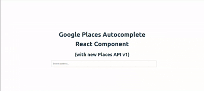

# React Google Places Autocomplete (v1 API) for React

A reusable, customizable, and accessible **React** component for Google Places Autocomplete using the **Places API v1**.

Ideal for address inputs where you need detailed location metadata, this package supports error handling, loading states, keyboard navigation, and custom renderers.

---

## ✨ Features

- Fully typed with **TypeScript**
- **Debounced** input handling
- **Custom render** support for suggestions
- Async **place detail fetching**
- **Loading state** with custom UI
- **Keyboard navigation support** (⬆️⬇️ coming soon)
- Accessibility attributes (`aria-*`)
- Clean fallback error handling with `onError`

---

## 🚀 Installation

```bash
npm install react-google-places-v1-autocomplete
```

---

## ⚙️ Usage

```tsx
import { GooglePlacesAutocomplete } from "react-google-places-v1-autocomplete";

<GooglePlacesAutocomplete
  apiKey="YOUR_GOOGLE_MAPS_API_KEY"
  onSelect={(place) => console.log(place)}
  onError={(error) => console.error(error)}
  debounceDelay={300}
  placeholder="Search for a place..."
  customLoader={<div>Loading suggestions...</div>}
  renderSuggestion={(suggestion) => (
    <strong>{suggestion.text.text}</strong>
  )}
/>
```

---

## 📊 Props

| Prop               | Type                                          | Required | Default               | Description                              |
| ------------------ | --------------------------------------------- | -------- | --------------------- | ---------------------------------------- |
| `apiKey`           | `string`                                      | Yes      | –                     | Your Google Places API key.              |
| `onSelect`         | `(place: PlaceDetails) => void`               | Yes      | –                     | Callback fired when a place is selected. |
| `onError`          | `(error: unknown) => void`                    | No       | –                     | Callback fired when API request fails.   |
| `placeholder`      | `string`                                      | No       | "Search address..."   | Placeholder for the input.               |
| `label`            | `string`                                      | No       | –                     | Optional label (not currently rendered). |
| `className`        | `string`                                      | No       | ""                    | Custom class for the wrapper container.  |
| `debounceDelay`    | `number`                                      | Yes      | 500                   | Delay in ms to debounce input.           |
| `customLoader`     | `React.ReactNode`                             | Yes      | "loading..."          | UI to show while fetching suggestions.   |
| `renderSuggestion` | `(suggestion: Suggestion) => React.ReactNode` | No       | Default text renderer | Custom UI for suggestion item.           |

---

## 📋 PlaceDetails Object Structure

The `onSelect` callback returns a `PlaceDetails` object:

```ts
interface PlaceDetails {
  name: string;
  lat: number;
  lng: number;
  placeId: string;
  id: string;
  types: string[];
  formattedAddress: string;
  location: {
    latitude: number;
    longitude: number;
  };
  viewport: {
    low: { latitude: number; longitude: number; };
    high: { latitude: number; longitude: number; };
  };
  googleMapsUri: string;
  displayName: {
    text: string;
    languageCode: string;
  };
}
```

---

## 🚨 Notes / Requirements

### Required from you:

- A valid **Google Cloud Platform API key** with `Places API` enabled.
- Billing must be enabled for your GCP project.
- Add your API key in the `apiKey` prop.
- (Optional but Recommended) Secure your API key with HTTP referrer restrictions.

### Potential TODOs (can be improved):

-

---

## ✨ Styling

No default styles are enforced except basic inline layout. You can apply your own styling using the `className` prop and by targeting internal class hooks like:

- `.new_place_select_input`
- `.new_place_select_dropdown`

---

## 🎓 License

MIT License. Free for personal and commercial use.

---

## 🙌 Contributions

Feel free to suggest features or create pull requests. If you're interested in contributing, drop a message!

---

<!--
SEO: react google autocomplete, react google places autocomplete, react google maps autocomplete, google places api v1 react, google places autocomplete component, google api react input, react autocomplete google v1, react places api autocomplete, google autocomplete widget react, react google places service
-->